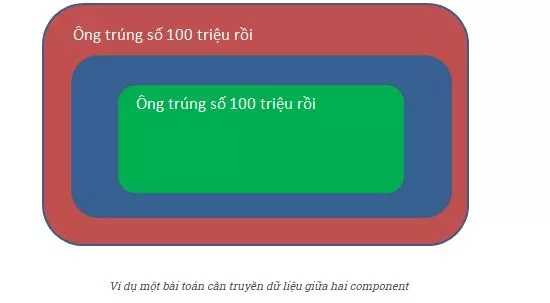

# Sử dụng useContent theo cách đơn giản nhất 
- Bạn đã bao giờ gặp trường hợp prop được yêu cầu bởi 1 component ở mọi nơi chưa ?
- Bạn có cảm thấy ức chế khi phải truyền 1 prop xuống 1 component trong react chỉ bởi mục đích đẩy tiếp nó xuống thằng cháu chưa ?
- Ở đây tôi có 1 giải pháp để giải quyết cho những khó khăn ở trên, nếu bạn có gặp thì tôi khuyên nên  tìm hiểu useContext trong react.

# Đặt Vấn Đề : 
- Trước khi bạn bắt tay vào tìm hiểu useContext trong react, thì mình có một bài toán như sau : 
 -Bạn có dữ liệu là 1 số với giá trị tin nhắn " Ông trúng số 1 trăm triệu rồi "
 -Bạn cần dữ liệu này ở trong 2 component là : Red và Blue
 -Blue component là con của Red và Red là con của Green component.
 -Theo như gia phả thì Blue là cháu của Green
- Vậy làm sao để gửi dữ liệu từ Green tới Blue ? 
- Thường thì bạn sẽ phải gửi dữ liệu từ Green xuống Red và từ Red đến Blue theo trình tự như thế.
  
### Với bài toán trên, bạn sẽ code như sau : 
```javascript
import React, { useState } from 'react'
const Blue = (props) => ( 
    <div className = "blue">{props.message}</div>
);
const Red = (props) => (
    <div className = "red">
        <Blue {props.message}/>
    </div>
);
const Red = () => {
  const [message, setMessage] = useState('Ông trúng số 100 triệu rồi');

  return (
    <div className="red">
      {message}
      <Blue message={message} />
    </div>
  );
};

export default Red;
```
- Nếu dự án thực tế, bạn có nhiều hơn 3 tầng trên thì vấn đề nó còn phức tạm đến cỡ nào nữa chứ ?
- Nếu trước đây, bạn có thể sử dụng Redux để sử lý vấn đề này. Từ react 16.3 thì bạn đã có giải pháp cho vấn đề đó là useContex.
# Vậy useContext là gì ?
- Hook useContex là một trong những hook cũng cấp bởi react để sử dụng  Contex trong ứng dụng.Context là 1 cơ chể để có thể truyền dữ liệu xuống các thành phần con mà không cần thông qua các thành phần trung gian. useContext cho phép bạn đọc giá trị của Context trong 1 thành phần.
##### Vậy làm sao để sử dụng nó ?
* Khi sử dụng useContext, bạn cần truyền vào 1 context object được tạo ra bằng createContext từ thành phần cha.Nó sẽ trả về giá trị hiện tại của Context.
* Ví dụ : 
```javascript
const value = useContext(SomeContext)
``` 
# Demo : 
##### 

##### 1. Create context, tạo 1 file có tên là ThemeContext: 
- import createContext từ thư viện react
- làm như thế này ta có thể dễ quản lý những thứ này hơn và có thể
- nhưng như thế này là chưa đủ vì cái thẻ vẫn chưa ôm được dữ liệu bên trong nó và trong JS ta có 1 property(thuộc tính) là children để có thể đại diện cho nội dung ta muốn truyền vào 
```javascript
import { useState, createContext } from 'react'

const ThemeContext = createContext();
// tạo 1 function tên ThemeProvider đi chẳng hạn
function ThemeProvider({ children }) {
    // tạo 1 useState để quản lý trạng thái khi ta bật tắt tonggle
    const [theme, setTheme] = useState('dark')
    // tạo 1 hàm để khi ta onClick thì nó có thể thay đổi trạng thái của theme
    const ButtonToggleTheme = () => {
        setTheme(theme === 'dark' ? 'light' : 'dark')
    }
    return (
        // provider dùng để bọc lại các thành phần con mà bạn muốn chia sẽ 
        <ThemeContext.Provider value = {theme}>
            { children }
        </ThemeContext.Provider>
    ) 
}
export {ThemeContext , ThemeProvider}
```
##### 2.Consumer, tạo 1 file là Content để lấy dữ liệu mà provider nó cung cấp  :
- Consumer là thành phần sử dụng dữ liệu được cung cấp bởi Provider. Nó nhận vào một hàm như children và truyền giá trị từ Provider vào hàm đó. Khi giá trị trong Provider thay đổi, Consumer sẽ tự động cập nhật lại để hiển thị dữ liệu mới.
```javascript
// imprort useContext từ thư viện của react
import { useContext } form 'react'
// import ThemeContext từ file ThemeContext
import { ThemeContext } form './ThemeContext'

function Content() {
    // khi ta sử dụng useContext ở đây thì ThemeContext.Provider có value là gì thì khi ta dùng nó ở đây thì nó có dữ liệu là cái đó
    const theme = useContext(ThemeContext);

    return (
        <p className = { theme }>
            Chào Cả Nhà Mình Nhá !!!
        </p>
    )
}
```
#####3. Tại file App.css ta css nhẹ để cho nó có chút màu sắc
```css
.dark {
    color : #fff;
    backgound-color : #ccc
}
```
- ở file App.js ta import file css này vào
#### Như vậy là chúng ta đã gần như hoàn thành về phần này bây giờ chỉ cần import chúng đúng chỗ nữa là hoàn thành.

# Từ useState đến useReducer
như ta đã biết useState có thể quản lý những trạng thái và thay đổi nó và các chức năng khác của react(lifecycle,side effect,...)
### 1 ví dụ nhỏ về useState
```javascript
import React, {useState} from 'react'

function Example() {
    const [state, setState] = useState(0);
    
    return (
        <div> 
            <button onClick = {() => setState(state + 1)}> 
                Click me : {state} 
            </button>
        </div>
    )
}
```
##### Như các bạn đã thấy ở ví dụ trên { useState }  hook khởi tạo initialState là tham số truyền vào, trả về cặp state value là { state } và 1 hàm dùng để update state đó { setState } 
### Vậy nếu logic state của component trên trở nên lớn và phức tạp hơn và khó quản lý hơn thì sao ?
###### Chẳng sao cả các bạn vẫn sử dụng useState làm việc chúng bình thường như chưa hề có cuộc chia ly !! (Ahihi !!). Chỉ là nó khiến bạn khó quản lý hơn và khi các bạn muốn nâng cấp hay bảo trì nó khó hơn chút mà thôi . Nhưng hôm nay tôi muốn giới thiệu các bạn về 1 hook mà ở đó có thể giúp bạn quản lý tốt việc đó.
###### Ở trong React Hook có 1 hook là useReducer được sinh ra để có dễ quản lý và tổ chức state tốt hơn. 
##### Vậy useReducer là gì mà nó có thể quản lý và tổ chức state tốt hơn useState ??
### Vậy thì sau đây mình xin giới thiệu đôi chút về useReducer !
# useReducer 
### useReducer là gì ?
- Thực chất useReducer là 1 phiên bản nâng cao của useState dùng trong trường hợp mà state của component phức tạp, có nhiều action làm thay đổi state đó
- Thay vì các bạn dùng nhiều useState hoặc useState với value là nested object/array và viết nhiều function để thay đổi state thì bây giờ các bạn có thể tổ chức state và các action làm thay đổi state đó 1 cách logic nhờ useReducer.

```javascript
const [state, dispatch] = useReducer(reducer, initialArg, init?)
```
- state : là trạng thái hiện tại của component
- dispatch : là 1 hàm được sử dụng để gửi hành động tới reducer để cập nhật trạng thái.Khi dispatch được gọi với 1 hành động, React nó sẽ gọi hàm reducer với trạng thái hiện tại và hành động đó để tính toán trạng thái mới,sau đó nó cập nhật state với trạng thái mới.
- reducer : là 1 hàm dùng để sử lý các thay đổi của trạng thái. Hàm này nhận vào 2 tham số (state, action) được thực hiện. Dựa trên hành động mà bạn truyền vào  hàm reducer sẽ trả về trạng thái mới.
ví dụ : 
```javascript
const reducer = (state , action) => {
    switch (action.type) {
        case 'INCREMENT':
            return { count: state.count + 1 };
        case 'DECREMENT':
            return { count: state.count - 1 };
        default:
            return state;
  }
}
```
- initialArg : là trạng thái ban đầu (init state ) của component.Đây có thể là giá trị bất kỳ.
- init? : init là một hàm tùy chọn được sử dụng để tạo trạng thái ban đầu nếu bạn cần thực hiện một loạt tính toán phức tạp hoặc không muốn tính toán trạng thái ban đầu. Hàm init nhận vào initialArg và trả về trạng thái ban đầu. Nếu bạn không cung cấp tham số này, initialArg sẽ được sử dụng trực tiếp làm trạng thái ban đầu. 
 # Demo : 
 ### Ở đây mình tạo 1 file tên là todoApp
 #### có 4 phần cần phải làm việc đó là :
 ##### 1. init state, xác định trạng thái ban đầu của nó  
 ```javascript
const initState = {
    job: '',
    jobs: []
};
 ```
##### 2. action, xử lý action khi reducer được gọi
```javascript
const SET_JOB = 'set_job';
const ADD_JOB = 'add_job';
const DELETE_JOB = 'delete_job';

const setJob = (payload) => {
    return {
        type: SET_JOB,
        payload
    }
}

const addJob = (payload) => {
    return {
        type: ADD_JOB,
        payload
    }
}
const deleteJob = (payload) => {
    return {
        type: DELETE_JOB,
        payload
    }
}
```
##### 3. reducer, hàm sử lý khi các thay đổi của trạng thái :
```javascript
const reducer = (state, action) => {
    switch (action.type) {
        case SET_JOB:
            return {
                ...state,
                job: action.payload
            };
        case ADD_JOB:
            return {
                ...state,
                jobs: [...state.jobs, action.payload]
            }
        case DELETE_JOB:
            const newJob = [...state.jobs]
            newJob.splice(action.payload, 1)
            return {
                ...state,
                jobs: newJob
            }
        default:
            throw new Error('Invalid action.', action.type)
    }
}
```
##### 4. dispatch ,hàm được sử dụng để gửi hành động tới reducer để cập nhật trạng thái :
```javascript
const TodoApp = () => {
    const [state, dispatch] = useReducer(reducer, initState)
    const { job, jobs } = state

    const inputRef = useRef()

    const handleSubmit = () => {
        dispatch(addJob(job))
        dispatch(setJob(''))

        inputRef.current.focus()
    }
    return (
        <div style={{ padding: '0 20px' }}>
            <h3>TodoApp</h3>
            <input
                ref={inputRef}
                value={job}
                placeholder=' enter todo'
                onChange={e => {
                    dispatch(setJob(e.target.value))
                }}
            />
            <button onClick={handleSubmit}>
                Add
            </button>
            <ul>
                {jobs.map((job, index) => (
                    <li key={index}>{job}
                        <button onClick={() => dispatch(deleteJob(index))}>
                            Delete
                        </button>
                    </li>
                ))}

            </ul>
        </div>
    )
}

```
# Cám ơn tất cả mọi người đã quan tâm và theo dõi bài thuyết trình của mình !